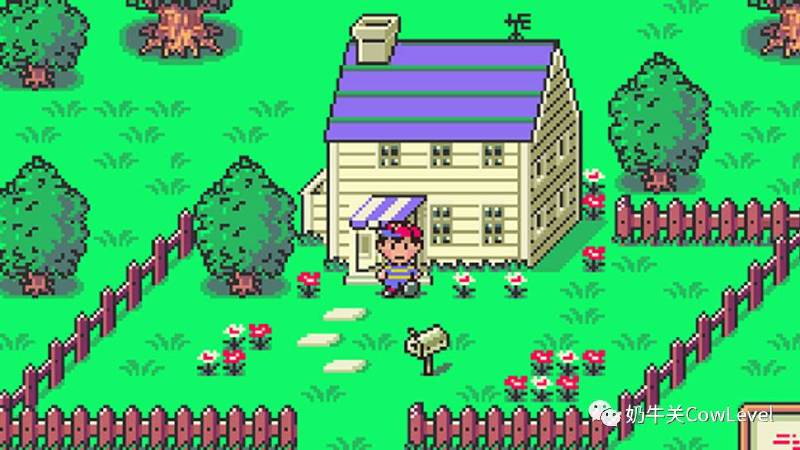
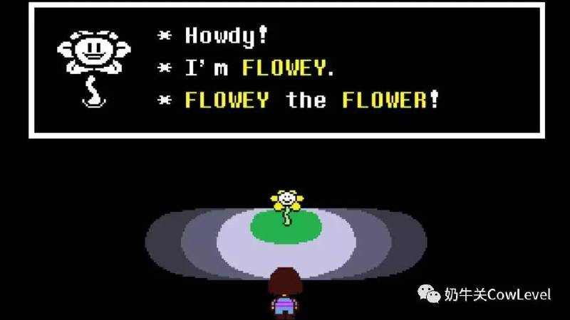
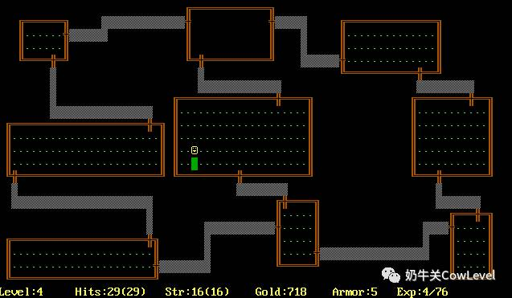
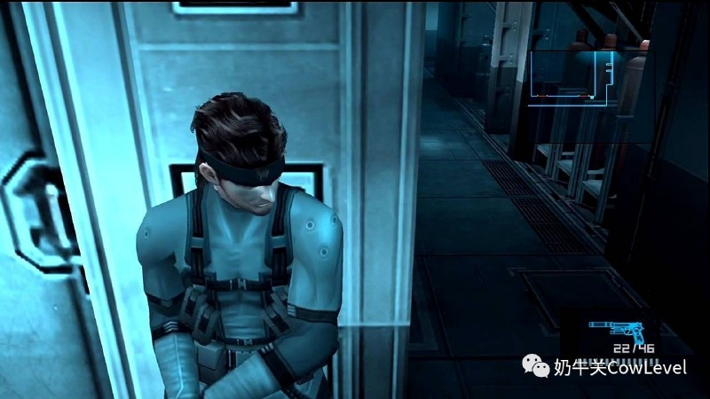
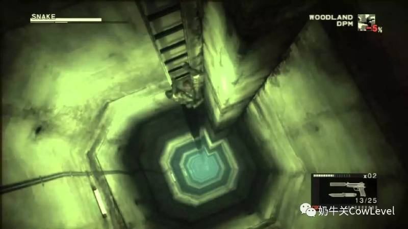
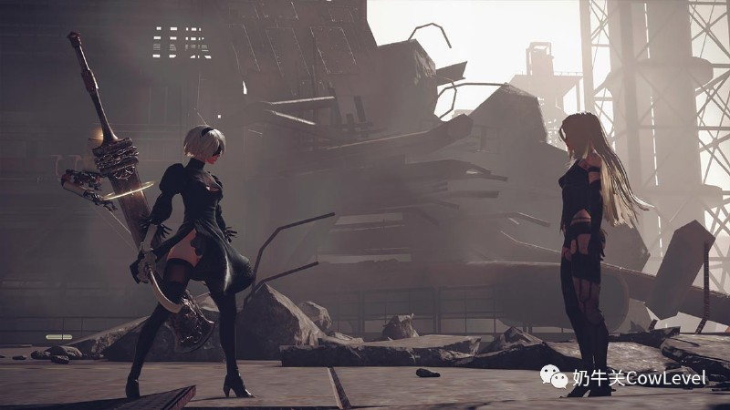
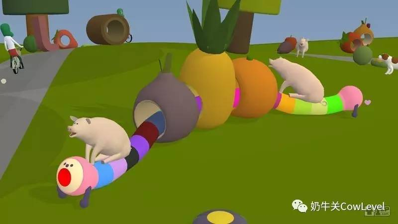
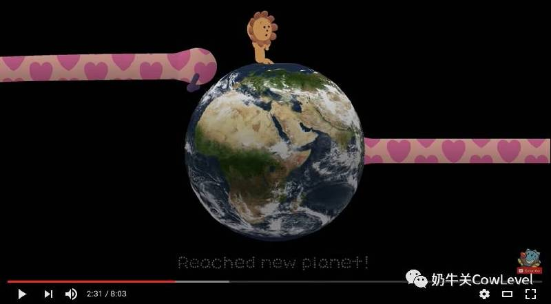
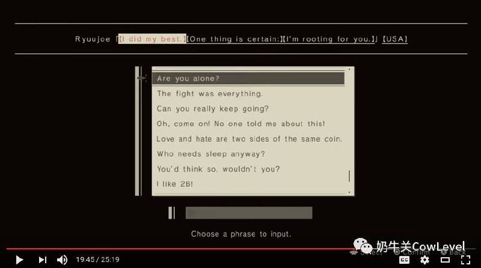
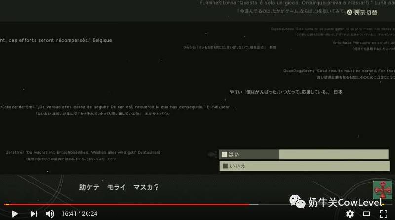

这是一篇讲述游戏如何利用科技与人性，制造奇迹与感动的文章。

她包含了以下作品的一些剧透：

**地球冒险 Earthbound**

**传说之下 Undertale**

**合金装备3：食蛇者 Metal Gear Solid 3: Snake Eater**

**三十航班之恋 Thirty Flights of Loving**

**伸缩男孩 Noby Noby Boy**

**尼尔：自动人形 Nier Automata**

如果您很在意惊喜，可以通关之后再来阅读——估计全部作品加起来，只需要数百小时。

如果您属于不在意剧透的旅客，请继续阅读——我们截取游戏历史长河中的一小杯水，做点不靠谱的推敲。

## 存档的本质

这篇文章的起因，是最近出炉的众多佳作之一，《Nier Automata》。

但在我们最终谈到她的结局与她的屁股之前，还得先回到20多年前，看一款叫做《Earthbound》的游戏。

发行于1994年的NES平台，《Earthbound》（也称为《Mother 2》）可能是最早颠覆日式RPG文化的作品之一。她把游戏场景从奇幻世界搬到了现代世界。设计师糸井重里，放弃刀剑与魔法，用儿童玩具与超能力取代，以求撰写一个更人性化的故事。

不过我们今天要谈的不是《Earthbound》的故事有多感人。

恰恰相反，我们想谈下她如何打击盗版者，使得他们无法获得好的体验。

《Earthbound》的卡带至少附带四个反盗版检测：

首先她判断游戏主机是不是PAL区。如果是，她会显示锁区信息。

接着她判断游戏卡带的存档空间是否少于8KB，因为盗版卡往往附带更多空间。如果是，显示盗版警告。

假如这些判断都被绕过了，她会在游戏里增加敌人的数量，以及在本没有敌人的区域，增添敌人。

假如玩家还能打到最终Boss，她会在Boss战时假死，玩家重启机器后，会发现所有存档被清空。

《Earthbound》可能不是最早的清空玩家存档的游戏作品，但她恐怕是最经典的一个。

重要的是，这本为限制盗版而设的功能，却揭示了一个引人深思的游戏哲学：

存档是玩家与游戏之间的记忆桥梁。

## 存档与叙事

时隔20多年，深受《Earthbound》与《Touhou Project》系列影响的设计师Toby Fox，制作了同样脍炙人口的《Undertale》，她结合了《Earthbound》的对战画面与《Touhou Project》的弹幕躲避机制。

《Undertale》重复利用「存档是记忆」的概念，一再颠覆玩家对「游戏可以记住多少事情」的假设：

每次New Game+，角色们都会根据玩家之前的行为改变台词。

如果玩家打通了游戏的最差结局，游戏会悄悄记录下来，确保玩家删除存档也无法再获得最好结局。

如果玩家打通了游戏的最佳结局，游戏会请求玩家，不要重复游戏，别让角色重新经历折磨。

在特定的场景下，游戏脚本甚至考虑到玩家「第6次通关」这种几乎不可能出现的情景。

在罕见的线路下，游戏角色会嘲笑那些「懒得亲自通关，搜索通关视频看」的玩家。

也因为这些细节上的创新，让《Undertale》获得与《Earthbound》类似的评价：

一款活生生的游戏。

## 游戏的魔术

毫无疑问，糸井重里和Toby Fox，并非全球仅有的两位「打玩家存档主意」的设计师。

《Rogue》，这部影响了一个游戏类型（Rogue-like）的作品，恰恰是利用「永久死亡」的概念，改变了玩家在游戏世界中的定位——从不畏死亡的英雄，变成了提心吊胆的普通人。

设计师小岛秀夫也有同样的想法。事实上，他想更进一步，制作一款「在玩家死亡时自动破坏游戏盘」的作品。

当然，没有游戏发行公司疯狂到为了设计师的怪诞想法，冒被消费者集体控诉的风险。

取而代之，小岛做了《Metal Gear》系列：一个从广告宣传到游戏剧情都在欺骗玩家的经典系列。

总结这个神棍系列超出了本文的范畴。但说起魔术，就不得不提这个场面——

在《Metal Gear Solid 3: Snake Eater》中，玩家控制的主角，要攀爬一道很高的梯子。

有多高呢？要爬几分钟这么高吧。

小岛这么设计似乎只有一个理由，播一段游戏原创的插曲。而攀爬梯子的时长，恰恰是那首歌的长度。

但真的如此吗？

如果你仔细观察玩家攀爬铁梯时的地面距离与贴图变化，它看起来是个「强制视角」的错视设计。

简单而言，玩家距离地面或许并不是如此远。游戏巧妙改变贴图之间的距离，制造高度的错觉。

同样的错视，也出现在《Thirty Flights of Loving》这款独立游戏中，她的开发者Brendon Chung解释了它的来源——主题公园的常用招数。

假如说，魔术师与主题公园的目标是「化不可能为可能」：

利用玩家无法察觉的方式作弊，是「游戏的魔术」。

## 结局的力量

终于，我们可以把话题扯回《Nier Automata》。

不，我们不准备谈相比小岛秀夫的老男人爬梯子，横尾太郎是如何制作年轻高叉女体机器人爬梯子的。

我们要谈的，是本作的最终结局——所谓的Ending E。

但我们要谈的，不是这个结局与主线故事的关系：

而是她如何巧妙的利用我们之前所说的一切，制造玩家意料之外的感动。

为此，我们还得再一次回溯时光。

时间回到2015年10月，《Undertale》英文版刚发售不久，《Nier》设计师横尾太郎在视频采访中承认，他很想玩这款游戏，只无奈没有日文版。

与此同时，《Nier Automata》还在紧张的前期开发中，团队E3发布刚过几个月，那时游戏的完成度才到10%。

我们不知道横尾太郎最后玩了《Undertale》没，但有一点是肯定的，他也喜欢「打玩家存档主意」。

在原版《Nier》中，横尾太郎就搞了这样的设计——玩家必须删除存档，才能拯救其他角色。

而《Nier Automata》更进一步：

与《Undertale》类似，她的最终结局要求玩家打一个几乎无法获胜的弹幕Boss（值得一提，前者也有类似的结尾弹幕）。

与《Metal Gear Solid 3: Snake Eater》类似，在挑战的过程中，玩家会听到一首悠扬的歌曲。

与《Nier》类似，玩家可能拯救他人，条件也是删除自己的通关存档。

毫无疑问，这个设计是成功的。配合多结局，《Nier Automata》获得评测者与玩家们几乎一致的好评。

但我们还没解释清楚，《Nier Automata》如何确保玩家获得这个好的体验？

## 结局的魔术

我们常说，结局是创作最难的部分；无论前面发生了什么，读者都希望获得一个他们可以接受的收官。

在游戏领域，为保持玩家感官上的「自由度」，设计师往往需要作点弊，才能让玩家心服口服。

2009年在PS3上发行的《Noby Noby Boy》是一个好的例子。这款游戏要求玩家「拉伸」一只称为「Boy」的可爱蚯蚓。随着全球玩家累积「拉伸值」，游戏中另一条巨大的蚯蚓，「Girl」，也会伸长。

玩家需要累积多长呢？大约太阳系直径这么长吧。

在游戏发售2489天后，也就是2015年12月14日，全球玩家完成了这个任务。作为回礼，游戏释出了一封感人的信件。

感动归感动。如果我们仔细想想，从地球到月球、火星、冥王星、绕去太阳并返回地球，这些距离根本不成比例。

《Noby Noby Boy》的设计师高桥庆太如何克服这个「数学难题」？幸运周的加倍增长，从最初的几倍，到最后的几百万倍。

说起玩家合作，让我们回头看看《Nier Automata》面对的「数学难题」：

在结局Boss战时，玩家会被系统询问，要不要获取他人帮助。一旦接受，玩家会获得更强的火力与看似无限的生命，歌曲也从独唱变成有和音。但与此同时，每次中弹，屏幕上都会显示「某某玩家的数据已经丢失」。

完成最终结局后，系统再次询问玩家，是否留言给其他玩家，以及是否以牺牲自己存档为代价，随机帮一位素不相识的玩家。揭示玩家之前获得的协助，来自其他通关玩家牺牲的存档。

不得不说，这是个聪明的设计。相比前作拯救虚拟角色，《Nier Automata》更上一层楼，把人类互助的精神展现了出来。

但我们仔细想想，假如每次攻略Boss都会牺牲如此多「存档」，而玩家获胜后，只能贡献一份「存档」。这个非营利公益组织不破产是说不通的。

安全可行的方式，是混入系统生成名字，或重复利用玩家ID。

无论哪种，鉴于绝大多数玩家只会攻略本作一次，要看出端倪，几乎是不可能的。

余下的问题是，《Nier Automata》怎么确保玩家「接受协助」？要是玩家实力太强，或者不愿放弃，咋办？

稍作调查，我们发现，横尾太郎至少准备了三招：

首先大幅度增加后期的弹幕密度，企图说服玩家寻求帮助。

如果玩家实力太强，游戏在「市场部」的回合会随机让玩家死亡，即便未碰到子弹。

假如玩家继续挑战，在数小时后，游戏会生成无法击落的名字，给玩家一个清晰的信号——别试了。

想必《Earthbound》的团队也不曾想到，当年反盗版的技术，会在20年后的今天，转辗成为《Nier Automata》给玩家留下美好回忆的技术。

## 最后的话语

以上所谈，仅是这些游戏的一小部分。如果要深挖，比如《Nier Automata》对电影《2001: A Space Odyssey》的致敬，也是可以再写一篇文章的。

但让我们就此打住，引用《L.A. Noire》过场里一段经典的旁白：

The case that makes you and the case that breaks you.

The one you never solve, the one that keeps you awake at night.

The case that gnaws at your guts and ruins your marriage.

The case that keeps you propping up a bar as you relive the what-ifs, the might-have-beens, the half-leads and half-truths.

The case that other cops murmur about whenever you walk past.

The case you never, ever, discuss.

把「case」替换成「game」，把「cop」替换成「player」，大概就是每位玩家希望体验的快乐吧。

Peace out.

*文章转载自奶牛关游戏社区*